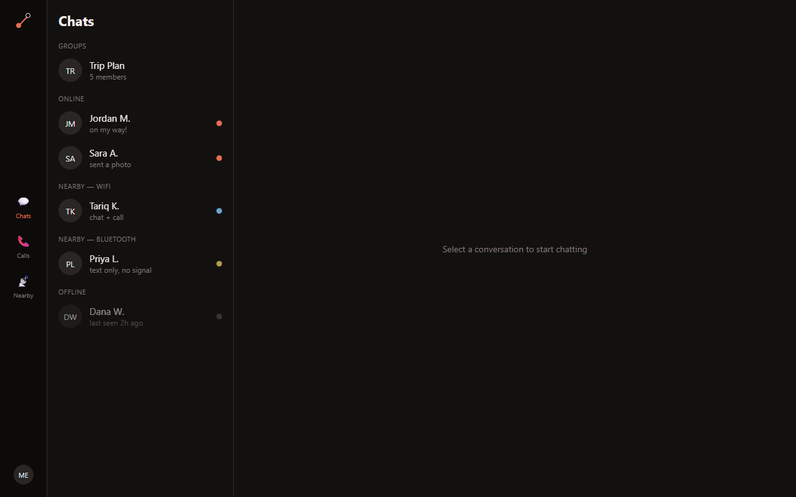
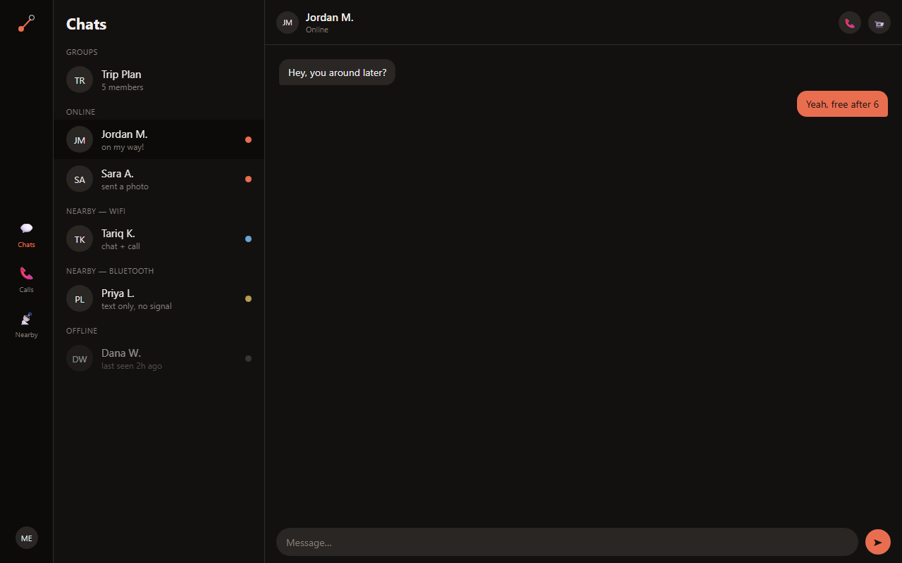
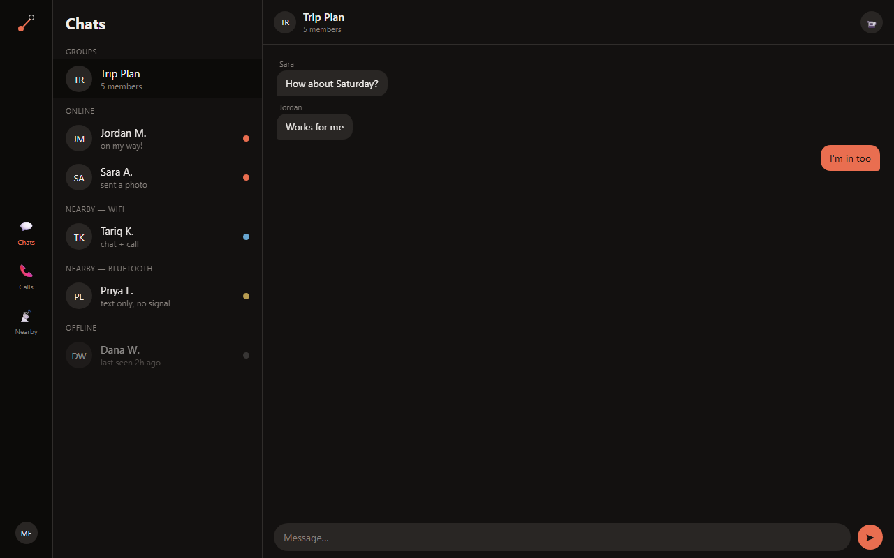
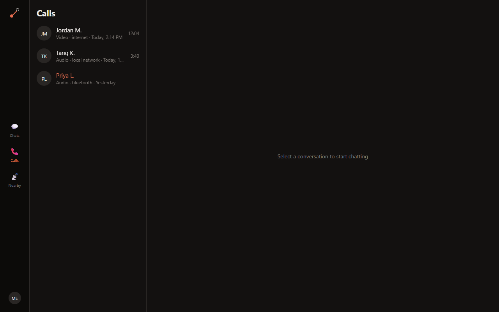
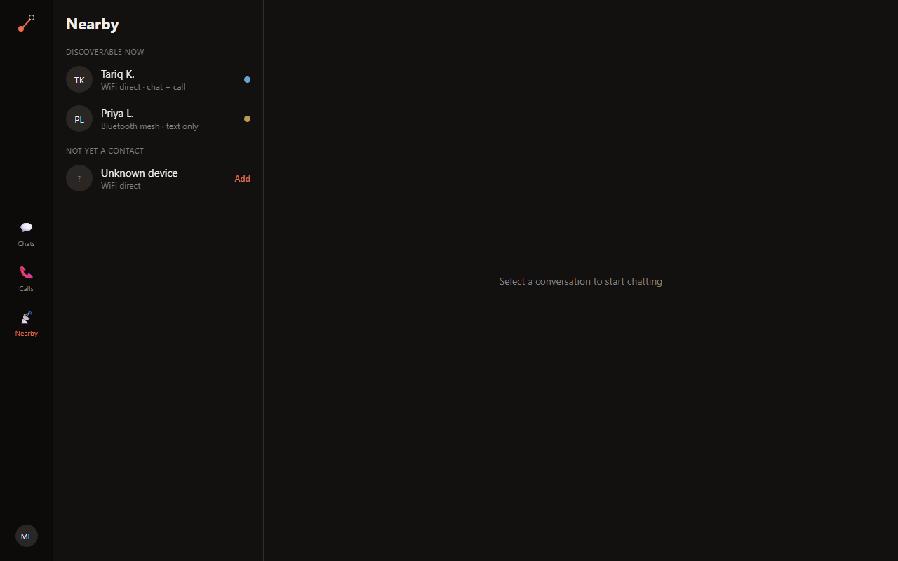
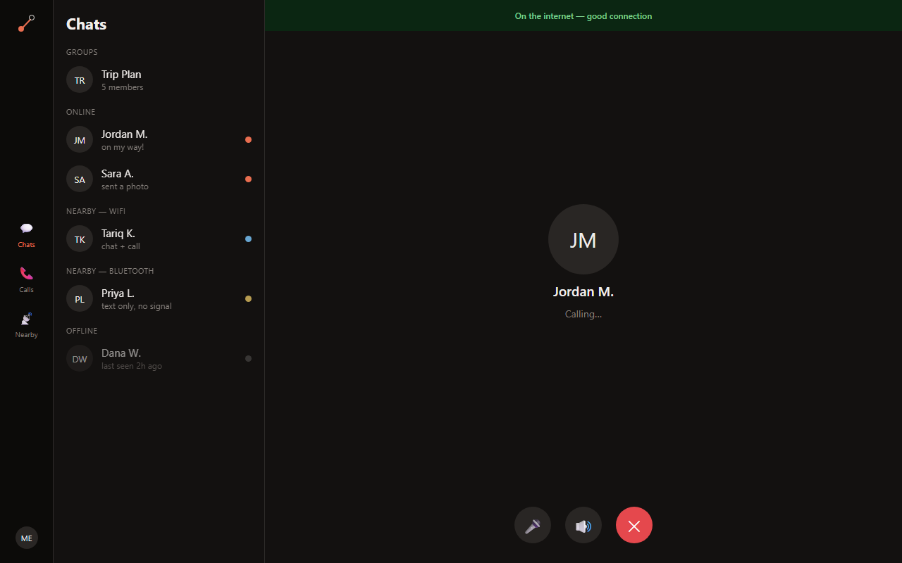
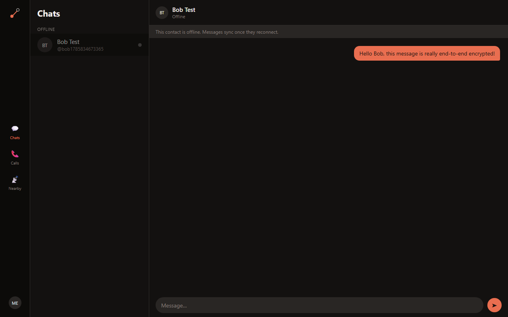
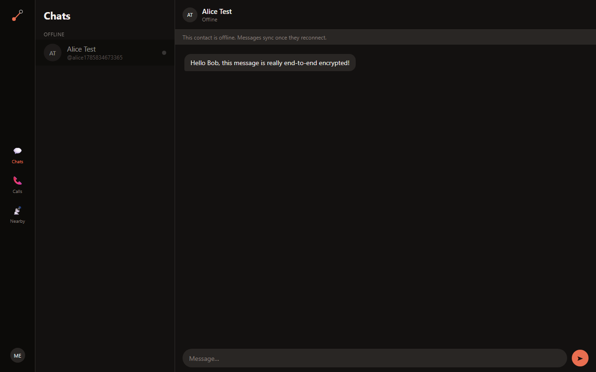

<div align="center">

<picture>
  <source media="(prefers-color-scheme: dark)" srcset="docs/logo-dark.svg">
  
</picture>

**A chat & calling app that never fully goes dark.**
Online over the internet, local over WiFi Direct, or fully offline over Bluetooth mesh — the same app, the same contacts, three transports.

</div>

---

## What is this?

Darkline is a WhatsApp-shaped chat/voice/video app built around one idea: connectivity is a spectrum, not an on/off switch. Most chat apps stop working the moment you lose signal. Darkline keeps working:

- **Online** — normal internet chat, voice, and video, signaled through a central server, media flowing peer-to-peer over WebRTC.
- **Local** — no internet, but a phone nearby? Chat *and calls* still work over a direct WiFi Direct link, with no server in the path.
- **Offline** — no network at all. Text messages still relay over a Bluetooth LE mesh to nearby devices (audio/video isn't possible at BLE bandwidths).

Every message is end-to-end encrypted regardless of which of the three transports it travels over — the server (and any BLE hop) only ever sees ciphertext.

## Screenshots

Captured from the actual running web build (`npm run web`) — same React Native codebase that renders the iOS/Android apps. The six-panel set below uses sample data to show every screen at once; the two-panel set after it is from a real live test — two separate accounts, signed up and paired for real, exchanging a message that was actually encrypted and decrypted with real libsodium keys (see [Project status](#project-status)).

| Chats | Thread | Group |
|---|---|---|
|  |  |  |

| Calls | Nearby | In-call |
|---|---|---|
|  |  |  |

**Real end-to-end encrypted message, live between two accounts:**

| Sender ("Alice") | Recipient ("Bob") |
|---|---|
|  |  |

## Features

**Messaging**
- 1:1 and group chat, real-time delivery via WebSocket, REST fallback for history/offline sync
- End-to-end encryption (X25519/Ed25519 via libsodium) — messages are encrypted client-side before they ever leave the device
- Offline-first: messages written while offline queue locally and sync automatically on reconnect

**Calling**
- 1:1 audio and video calls over WebRTC
- Group calls (grid layout, active-speaker highlighting)
- Native incoming-call UI (CallKit / ConnectionService) on mobile

**Presence & connectivity**
- Live presence (online / nearby-WiFi / nearby-Bluetooth / offline) per contact
- Nearby-device discovery and first-contact pairing over WiFi Direct / BLE
- Automatic transport switching — the app picks internet, local, or offline mesh based on what's actually reachable

**Auth**
- Email/password, phone/OTP, and Google sign-in
- Full account lifecycle: email verification, forgot/reset password, account lockout after repeated failed logins, linked-accounts management, session handling

**Security**
- Client-side E2EE (X25519 key exchange + authenticated encryption), with signed prekey bundles verified before every new conversation
- Private keys never leave the device (OS Keychain/Keystore on mobile)
- Zero-knowledge server: the backend and any relay only ever handle ciphertext + minimal routing metadata (sender, recipient, timestamp)

## Tech stack

**Frontend** — one React Native codebase (bare CLI, not Expo) for iOS, Android, *and* web via `react-native-web` + Vite
- State: [Zustand](https://github.com/pmndrs/zustand)
- Real-time: `socket.io-client`
- Calling: `react-native-webrtc` (native) / browser `RTCPeerConnection` (web)
- E2EE: `react-native-libsodium` (native) / `libsodium-wrappers` (web) — same API, platform-split
- Offline mesh: `react-native-ble-plx` (BLE), `react-native-wifi-p2p` (WiFi Direct, Android), `react-native-tcp-socket` (local signaling)
- Local-first storage: [WatermelonDB](https://watermelondb.dev/) (SQLite on native, LokiJS/IndexedDB on web)
- Native call UI: `react-native-callkeep`; key storage: `react-native-keychain`; connectivity: `@react-native-community/netinfo`

**Backend** — Turborepo monorepo, four independently-deployable Node.js + TypeScript services
- **`api`** — REST API (Express): auth, users, contacts, conversations, messages, calls, prekeys, media, presence
- **`ws-signaling`** — real-time layer (socket.io + Redis adapter): presence broadcast, typing, and WebRTC call signaling (offer/answer/ICE relay)
- **`fanout-worker`** — Kafka consumer that delivers new messages to online recipients over the socket.io layer
- **`notification-worker`** — Kafka consumer → Firebase Cloud Messaging for offline recipients (scaffolded)
- Shared packages: `db` (Mongoose schemas), `shared-types` (cross-service event/API types), `config` (validated env)

**Infrastructure**
- MongoDB (documents), Redis (presence, pub/sub, rate limiting), Kafka (event backbone for message fan-out), Docker Compose (local dev)
- JWT auth (access + rotating refresh tokens), bcrypt, Google ID-token verification
- AWS S3 (media, pre-signed uploads)

## Repo structure

```
darkline/
  frontend/    React Native app — iOS, Android, and web from one codebase
  backend/     Turborepo monorepo — api, ws-signaling, fanout-worker, notification-worker
  docs/
    design-reference/   Original UI prototypes + full product/architecture spec
    setup/               Step-by-step setup for both frontend and backend
```

## Getting started

- Backend: [`docs/setup/backend-setup.md`](docs/setup/backend-setup.md) — `pnpm install`, `docker-compose up`, `pnpm dev`
- Frontend: [`docs/setup/frontend-setup.md`](docs/setup/frontend-setup.md) — native project setup, running iOS/Android/web
- Design reference: [`docs/design-reference/`](docs/design-reference/) — click-through prototypes (`.dc.html`) and the full architecture doc everything here is built from

## Project status

This is an active build, not a finished product. Roughly:

**Solid and verified against a live stack** (real Mongo/Redis/Kafka, not just type-checked): auth (all 11 routes — signup, login, phone OTP, Google, password reset, etc.), chat REST routes, real-time message delivery end-to-end (REST → Kafka → fanout-worker → WebSocket), call signaling relay, the E2EE crypto module (roundtrip/tamper/wrong-recipient tests all pass against real libsodium), and the frontend's auth flow wired to the real API.

**Built but unverifiable in this dev environment** (no physical device/emulator available while building): the native BLE mesh, WiFi Direct, WebRTC, and CallKeep integrations. The code is written against each library's real API, but hasn't run on an actual device yet — treat it as a first pass to test and debug on real hardware, not as proven-working.

**Not built yet**: chat/call *screens* are still on demo data (the API client and store actions exist and are tested — see above — but the UI hasn't been switched over to render live conversations yet), Double Ratchet forward secrecy (current E2EE is real but static-key, no per-message rekeying), multi-hop BLE mesh routing (single-hop only, by design — see the architecture doc's scaling notes), and push notifications.

See `docs/design-reference/darkline-complete-context.md` for the complete architecture rationale behind every decision above.
